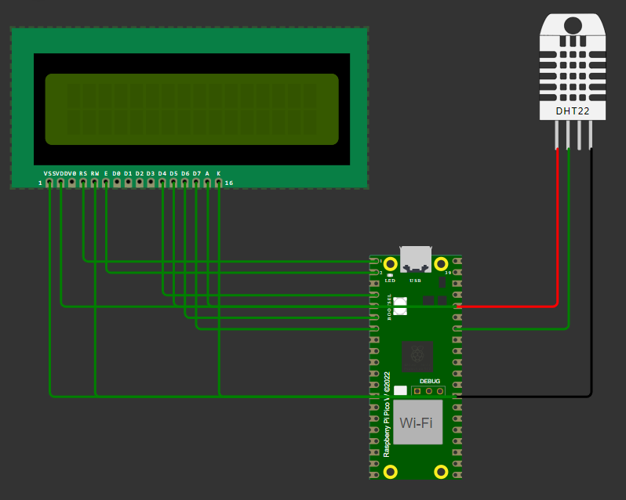

# Raspberry Pi Pico DHT22 Humidity Monitor

This project demonstrates how to use a DHT22 sensor with a Raspberry Pi Pico to monitor humidity and display it on an LCD.

## Components Used
- Raspberry Pi Pico
- DHT22 (AM2302) Temperature and Humidity Sensor
- 16x2 LCD Display

## Libraries Required
- [DHT sensor library](https://github.com/adafruit/DHT-sensor-library)
- [LiquidCrystal library](https://github.com/arduino-libraries/LiquidCrystal)

## Circuit Diagram

## Installation and Setup
1. **Install Libraries:**
   - Install the DHT sensor and LiquidCrystal libraries if you haven't already.

2. **Connections:**
   - Connect the DHT22 sensor and LCD display to the Raspberry Pi Pico as per the wiring instructions in your code.

3. **Upload the Code:**
   - Upload the provided Arduino sketch (`dht22_lcd_display.ino`) to your Raspberry Pi Pico using the Arduino IDE or another compatible IDE.

4. **Monitor Output:**
   - Open the Serial Monitor at `9600 baud` to view the humidity readings and debug messages.
   - The LCD will display the current humidity reading in percentage.

## Troubleshooting
- **No Reading:**
  - Check the wiring of the DHT22 sensor and ensure it is connected to the correct pin (`GP28` in this example).
  - Ensure the sensor is powered properly and the data line is connected securely.

- **LCD Display Issues:**
  - Double-check the connections of the LCD display, especially the contrast control (`V0` pin).
  - Verify the pins defined in your code match the actual connections.

## Check out here:

 `https://wokwi.com/projects/401955886530020353`

